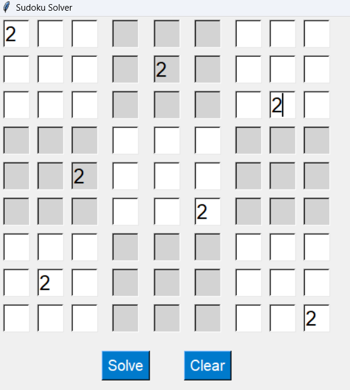
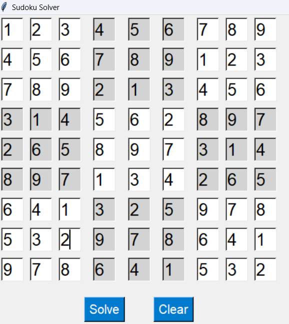

# Sudoku Solver

This is a Sudoku Solver application built with Tkinter.

## Screenshots

### Initial State

### Solved Puzzle

## Usage

1. Enter the Sudoku puzzle into the grid.
2. Click "Solve" to solve the puzzle.
3. Click "Clear" to clear the grid.

## Requirements

- Python 3.x
- Tkinter

